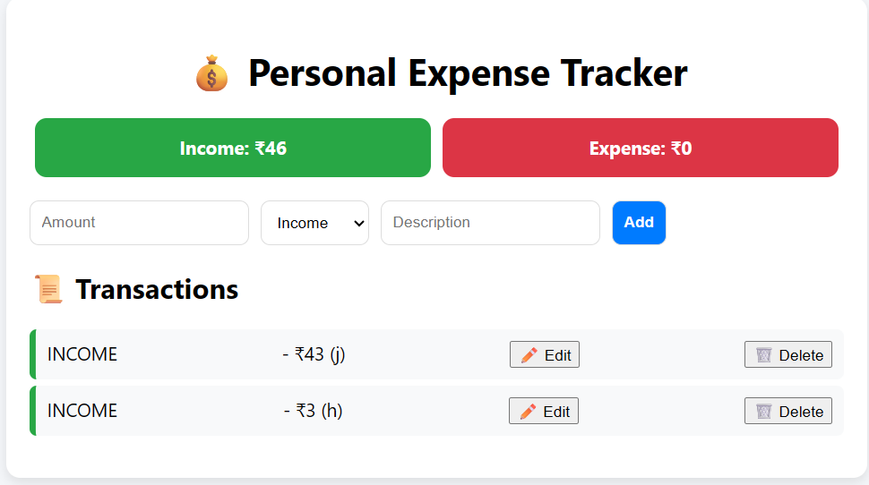

# 💰 Expense Tracker (React + Spring Boot)

A simple yet powerful **Expense Tracker** application built with **React (frontend)** and **Spring Boot + MySQL (backend)**.  
It allows users to **add, edit, delete, and view transactions** (income/expense) with a clean and modern UI.  

---

## 🚀 Features
- ✅ Add transactions with amount, type (Income/Expense), and description  
- ✅ View total **Income** and **Expense**  
- ✅ Edit or delete transactions  
- ✅ Data persistence with **Spring Boot + MySQL**  
- ✅ Responsive UI with **React**  

---

## 🛠️ Tech Stack
**Frontend:** React, Axios, CSS  
**Backend:** Spring Boot, Java, Spring Data JPA  
**Database:** MySQL (via XAMPP or standalone)  

---

## 📂 Project Structure
expense-tracker/
│
├── backend/ # Spring Boot project
│ ├── src/main/java/...
│ └── src/main/resources/application.properties
│
├── frontend/ # React project
│ ├── src/App.js
│ ├── src/App.css
│ └── ...
│
└── README.md

---

## ⚙️ Setup Instructions

### 1️⃣ Backend (Spring Boot)
1. Clone the repo:
   ```bash
   git clone https://github.com/your-username/expense-tracker.git
   cd expense-tracker/backend
Configure application.properties:

properties
Copy
Edit
spring.datasource.url=jdbc:mysql://localhost:3306/expense_tracker
spring.datasource.username=root
spring.datasource.password=yourpassword
spring.jpa.hibernate.ddl-auto=update
Run the backend:


mvn spring-boot:run

2️⃣ Frontend (React)
Navigate to frontend folder:


cd ../frontend
Install dependencies:

npm install
Run the app:

npm start
App runs on:

Frontend: http://localhost:3000

Backend: http://localhost:8080

📸 Screenshots


🌟 Future Enhancements
🔹 Add categories (Food, Travel, Shopping, etc.)

🔹 Export reports (CSV/PDF)

🔹 User authentication (JWT + Spring Security)

🔹 Deploy to Netlify + Render for live demo

🤝 Contributing
Contributions are welcome! Feel free to fork the repo and submit a PR.

📜 License
This project is licensed under the MIT License.
